# UniManage Plus


## Smart University Service Management Platform

UniManage Plus is a modern enterprise-style University Service Management Platform developed to streamline academic administration, student services, assignment workflows, enrollment management, reporting, analytics, and role-based university operations within a centralized digital ecosystem.

The platform was designed and implemented as a full-stack web application using React.js, Flask, and MySQL while following enterprise software engineering principles such as:

- layered architecture,
- RESTful API development,
- workflow automation,
- audit logging,
- role-based authorization,
- responsive UI/UX design,
- and scalable academic workflow management.

---

## Table of Contents

- [Project Overview](#project-overview)
- [Screenshots](#screenshots)
- [Project Objective](#project-objective)
- [Key Features](#key-features)
- [User Roles](#user-roles)
- [Core Modules](#core-modules)
- [Technology Stack](#technology-stack)
- [System Architecture](#system-architecture)
- [Database Features](#database-features)
- [Project Structure](#project-structure)
- [Quick Start](#quick-start)
- [Installation Guide](#installation-guide)
- [Workflow Overview](#workflow-overview)
- [Security Features](#security-features)
- [Analytics & Reporting](#analytics--reporting)
- [Responsive Design](#responsive-design)
- [Testing & Validation](#testing--validation)
- [Future Improvements](#future-improvements)
- [Academic Value](#academic-value)
- [Conclusion](#conclusion)

---

## Project Overview

Traditional university management processes often rely on disconnected systems, spreadsheets, emails, and manual workflows. These approaches frequently result in:

- inefficient communication,
- duplicated data,
- delayed approvals,
- limited workflow visibility,
- inconsistent record management,
- and poor operational scalability.

UniManage Plus addresses these challenges by providing a centralized digital platform capable of managing:

- academic operations,
- student workflows,
- assignment lifecycle management,
- course coordination,
- grade approval processes,
- notifications,
- analytics,
- reporting,
- and secure role-based access control.

The system aims to improve operational efficiency, workflow transparency, data integrity, and academic coordination within modern university environments.

---

## Screenshots

<table>
<tr>
<td width="50%">

#### Login Page
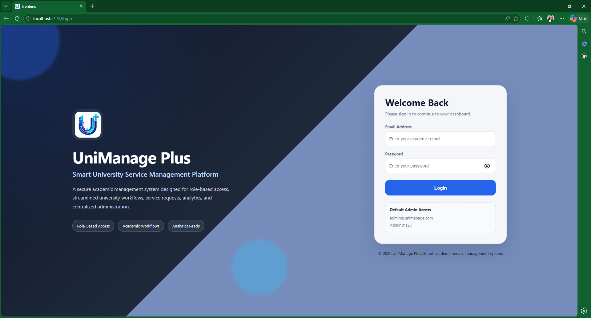

</td>
<td width="50%">

#### Admin Dashboard
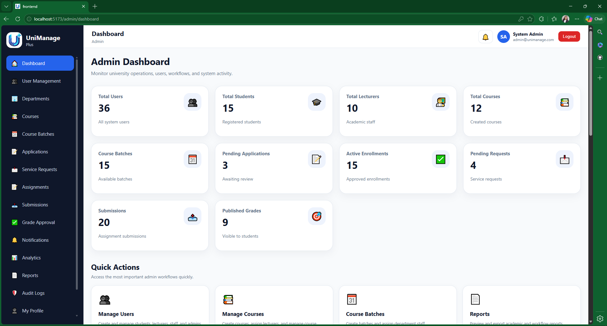

</td>
</tr>

<tr>
<td width="50%">

#### User Management
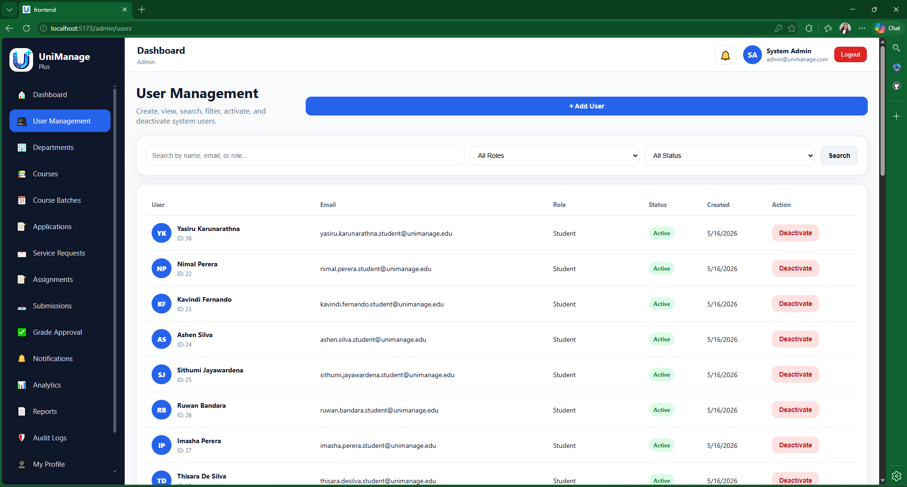

</td>
<td width="50%">

#### Course Management
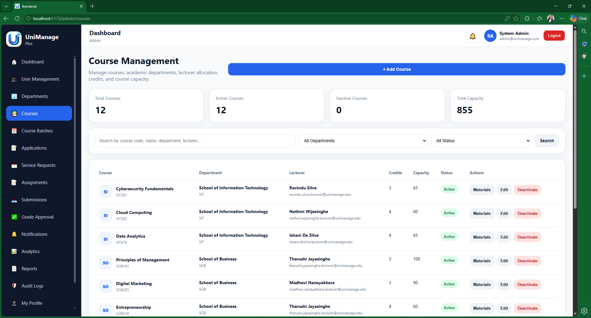

</td>
</tr>

<tr>
<td width="50%">

#### Course Batches Management
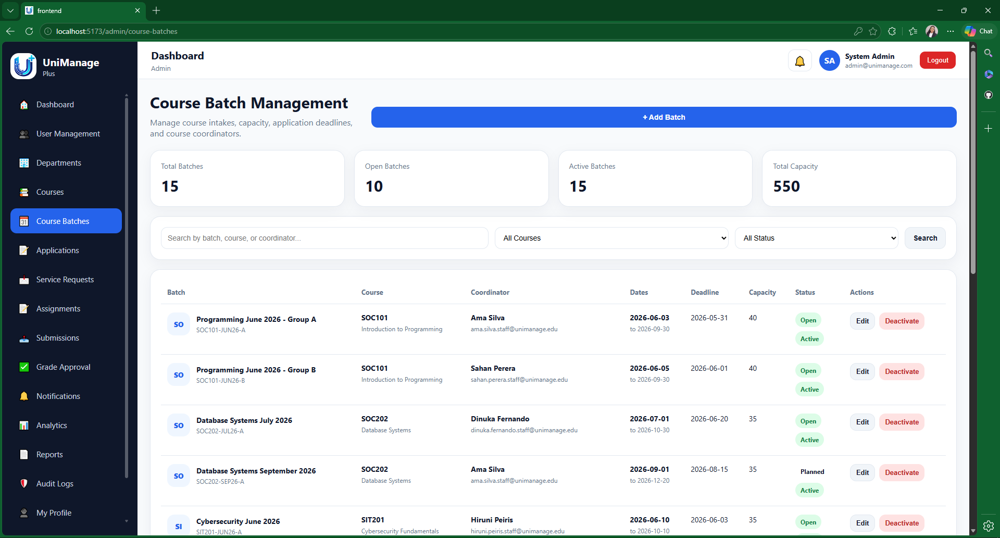

</td>
<td width="50%">

#### Course Applications
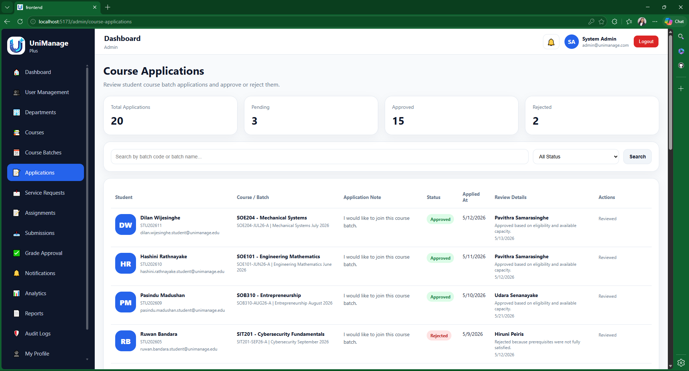

</td>
</tr>

<tr>
<td width="50%">

#### Service Requests
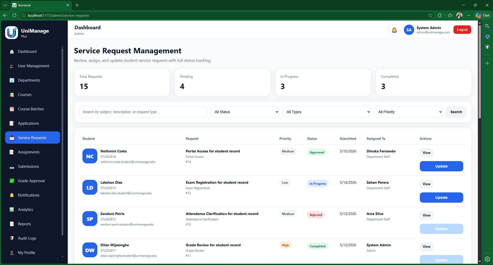

</td>
<td width="50%">

#### Assignments Management
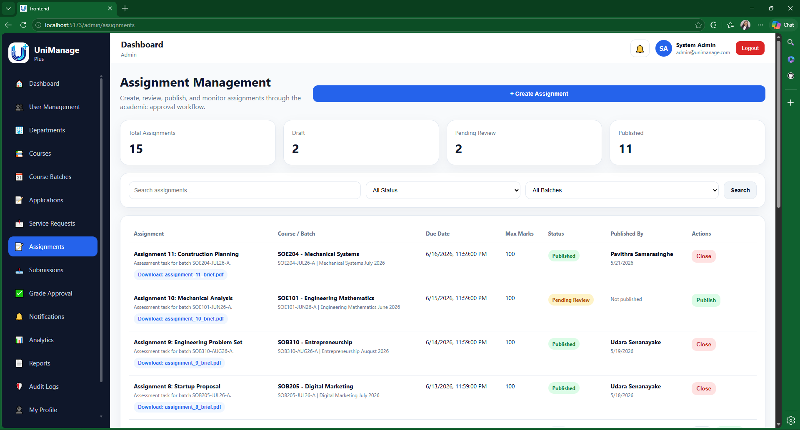

</td>
</tr>

<tr>
<td width="50%">

#### Submissions Management
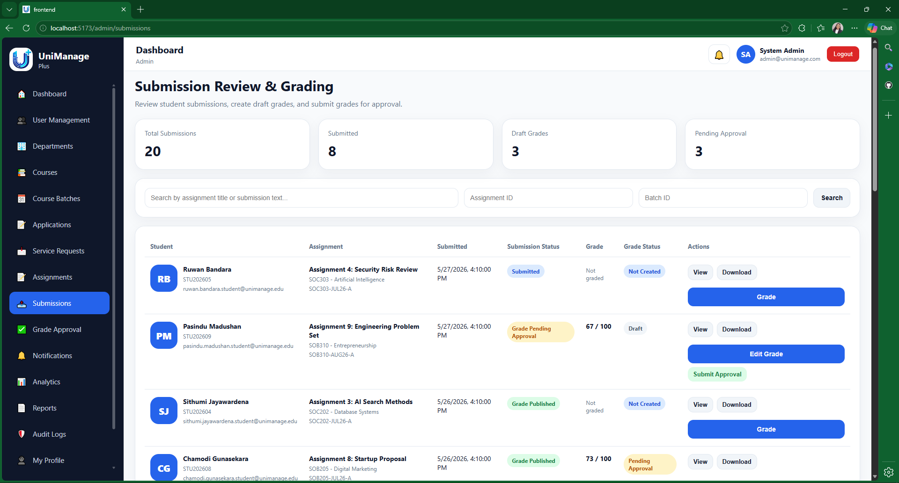

</td>
<td width="50%">

#### Grade Approval
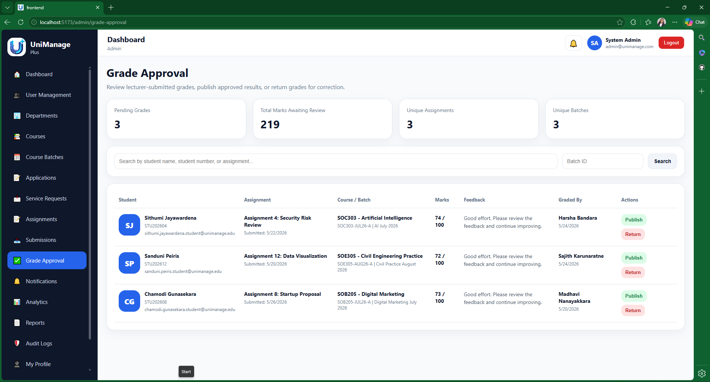

</td>
</tr>

<tr>
<td width="50%">

#### Analytics Dashboard
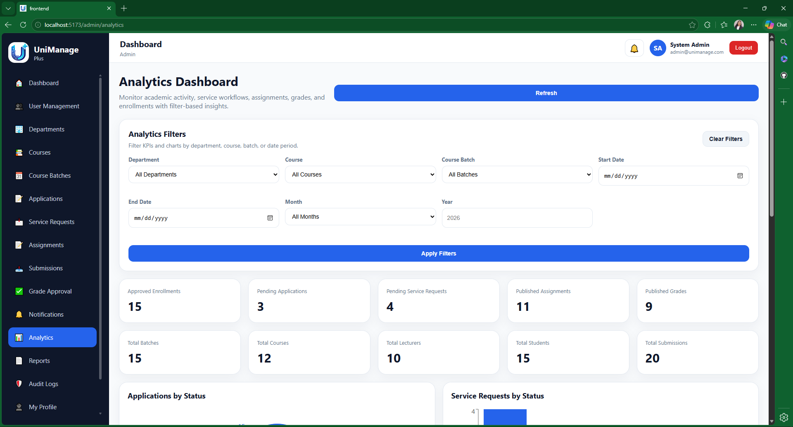

</td>
<td width="50%">

#### Reports Management
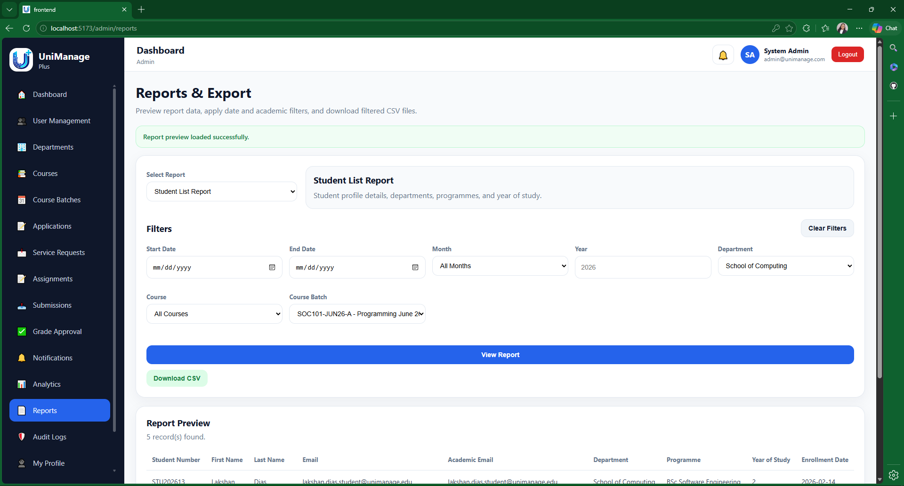

</td>
</tr>

<tr>
<td width="50%">

#### Audit Logs
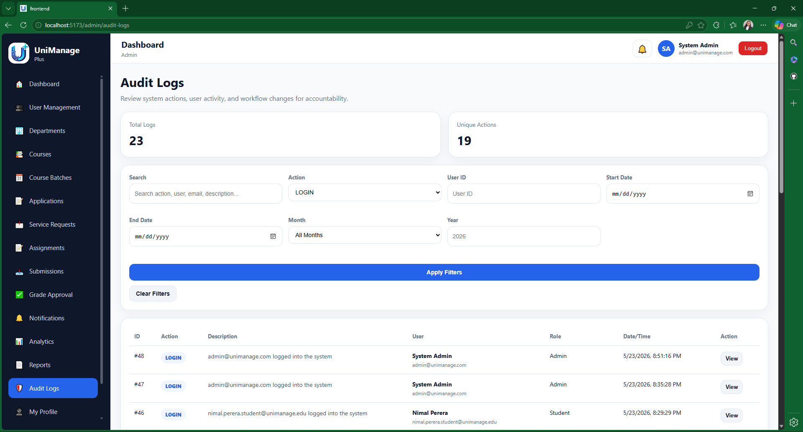

</td>
<td width="50%">

#### Profile Page
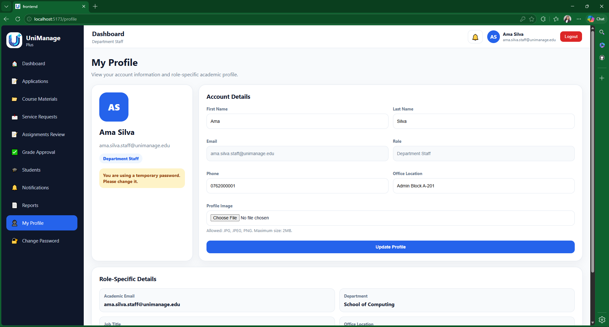

</td>
</tr>

<tr>
<td width="50%">

#### Department Staff Dashboard
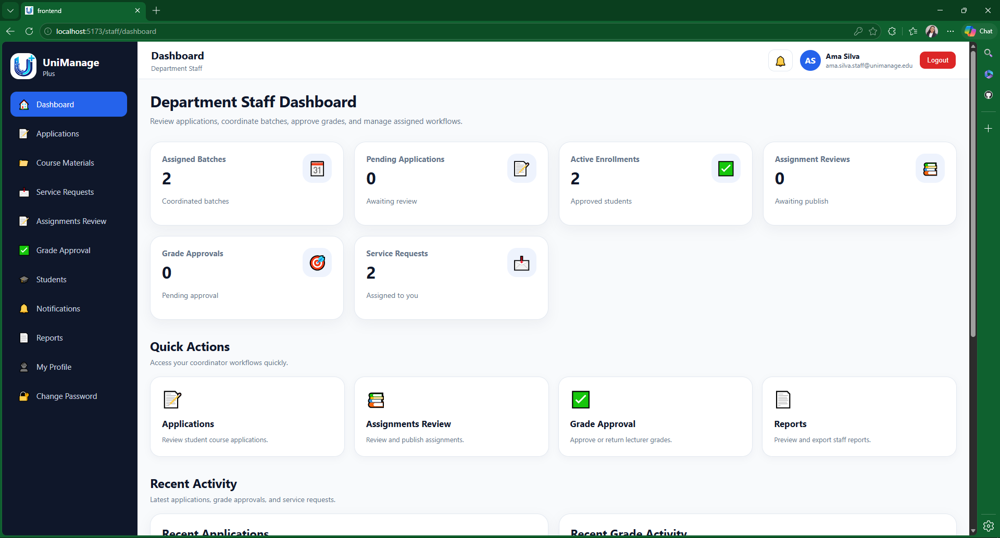

</td>
<td width="50%">

#### Lecturer Dashboard
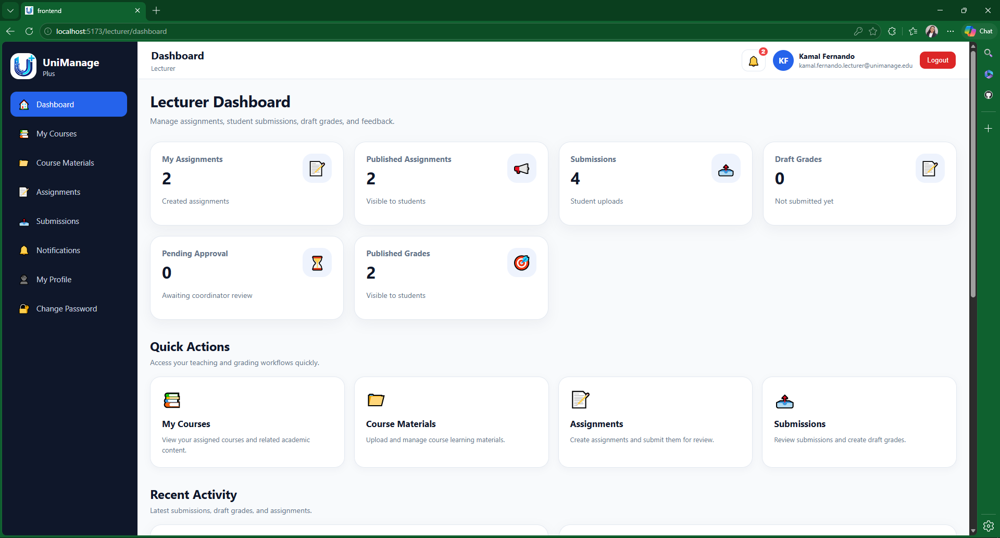

</td>
</tr>

<tr>
<td width="50%">

#### Notifications
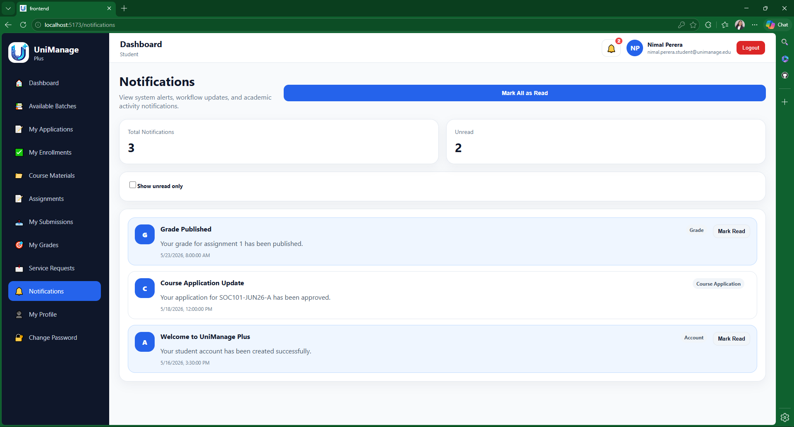

</td>
<td width="50%">

#### Student Dashboard
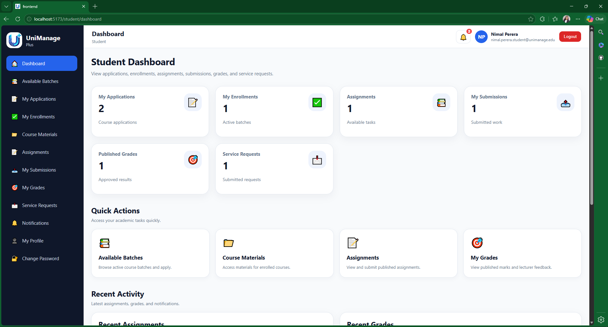

</td>
</tr>
</table>

---

## Project Objective

The primary objective of UniManage Plus is to centralize and automate academic and administrative workflows within university environments through a secure, scalable, and workflow-driven digital platform.

The system aims to improve:

- academic coordination,
- workflow efficiency,
- approval transparency,
- operational scalability,
- centralized data management,
- and user accessibility across multiple university roles.

---

## Key Features

### Authentication & Security

- JWT-based authentication
- Role-based authorization
- Protected frontend routes
- Werkzeug password hashing
- JWT token-based session management
- Temporary password enforcement
- Password change functionality
- Secure API access
- Audit logging system

---

### Enterprise Dashboard System

- Role-based dashboards
- KPI summary cards
- Workflow activity tracking
- Recent activity widgets
- Quick action panels
- Notification badge system
- Responsive dashboard layouts

---

### Workflow Automation

- Application approval workflows
- Assignment review workflows
- Grade approval workflows
- Enrollment management workflows
- Service request workflows
- Notification-driven updates

---

### Reporting & Analytics

- KPI analytics dashboards
- Interactive charts
- Filter-based analytics
- Department/course/batch filtering
- Export-ready reports
- Workflow monitoring

---

## User Roles

The platform supports four primary user roles with dedicated workflows and permissions.

| Role | Main Responsibilities |
|---|---|
| **Admin** | Manage users, departments, courses, course batches, workflows, analytics, reports, audit logs, and overall university operations |
| **Lecturer** | Manage assignments, upload course materials, review submissions, create draft grades, submit grades for approval, and monitor academic progress |
| **Student** | Apply for course batches, manage enrollments, access materials, submit assignments, view grades, receive notifications, and submit service requests |
| **Department Staff** | Review applications, coordinate batches, review assignments, approve grades, manage service requests, monitor workflows, and generate department reports |

---

## Core Modules

### User Management

- User creation and management
- Role assignment
- Account activation/deactivation
- Academic profile management
- Temporary password support

---

### Department Management

- Department creation and management
- Department-based filtering
- Academic organization support

---

### Course Management

- Course creation
- Lecturer assignment
- Course status management
- Course filtering and search

---

### Course Batch Management

- Batch scheduling
- Enrollment management
- Capacity tracking
- Coordinator assignment
- Application deadlines

---

### Course Applications & Enrollments

- Student applications
- Approval workflows
- Enrollment tracking
- Batch participation management

---

### Assignment Management

- Assignment lifecycle workflows
- File upload and download support
- Assignment review and publishing
- Submission review workflows

---

### Grade Management

- Draft grades
- Grade approval workflows
- Published grades
- Student grade access

---

### Notifications Module

- System notifications
- Workflow notifications
- Notification badge system
- Real-time UI updates

---

### Analytics Dashboard

- KPI summaries
- Workflow analytics
- Enrollment trends
- Assignment analytics
- Grade analytics
- Service request analytics
- Filtered charts and reporting

---

### Reporting Module

- Preview reports
- Export reports
- Filter-based reports
- Department analytics
- Batch analytics

---

### Audit Logging

- System activity tracking
- User action logging
- Security monitoring
- Workflow traceability

---

### User Profiles

- Role-specific profile pages
- Profile image upload
- Password management
- Academic profile information

---

## Technology Stack

| Layer | Technologies |
|---|---|
| **Frontend** | React.js, React Router, Axios, Recharts, CSS3 |
| **Backend** | Flask, Flask-JWT-Extended, Flask-SQLAlchemy, Flask-Migrate, RESTful API Architecture |
| **Database** | MySQL |

---

## System Architecture

The platform follows a layered enterprise architecture.

```text
Frontend Layer (React.js)
          ↓
REST API Layer (Flask)
          ↓
Service Layer
          ↓
Data Access Layer
          ↓
MySQL Database
```

---

## Database Features

The database architecture was designed using relational database principles and normalization techniques.

Key features include:

- relational schema design,
- foreign key relationships,
- normalized database structure,
- entity relationship modeling,
- indexing and optimized querying,
- audit logging support,
- role-specific profile tables,
- workflow-driven entities,
- and scalable academic data management.

---

## Project Structure

### Frontend Structure

```text
frontend/
├── src/
│   ├── assets/
│   ├── components/
│   ├── context/
│   ├── layouts/
│   ├── pages/
│   ├── services/
│   ├── App.css
│   ├── App.jsx
│   └── main.jsx
```

---

### Backend Structure

```text
backend/
├── app/
│   ├── models/
│   ├── routes/
│   ├── services/
│   ├── static/
│   ├── utils/
│   ├── __init__.py
│   ├── config.py
│   ├── extensions.py
│   └── seed.py
├── migrations/
├── requirements.txt
└── run.py
```

---

## Quick Start

### Backend

```bash
cd backend

python -m venv venv

venv\Scripts\activate

pip install -r requirements.txt

flask db upgrade

python run.py
```

---

### Frontend

```bash
cd frontend

npm install

npm run dev
```

---

## Installation Guide

### Backend Setup

#### 1. Clone Repository

```bash
git clone <repository-url>
```

---

#### 2. Navigate to Backend

```bash
cd backend
```

---

#### 3. Create Virtual Environment

```bash
python -m venv venv
```

---

#### 4. Activate Virtual Environment

#### Windows

```bash
venv\Scripts\activate
```

#### Linux / Mac

```bash
source venv/bin/activate
```

---

#### 5. Install Dependencies

```bash
pip install -r requirements.txt
```

---

#### 6. Configure Environment Variables

Create a `.env` file:

```env
FLASK_APP=run.py
FLASK_ENV=development

DB_HOST=localhost
DB_PORT=3306
DB_NAME=unimanage_plus_db
DB_USER=root
DB_PASSWORD=your_password

JWT_SECRET_KEY=your_secret_key
```

---

#### 7. Run Database Migrations

```bash
flask db upgrade
```

---

#### 8. Run Backend Server

```bash
python run.py
```

---

### Frontend Setup

#### 1. Navigate to Frontend

```bash
cd frontend
```

---

#### 2. Install Dependencies

```bash
npm install
```

---

#### 3. Configure Environment Variables

Create a `.env` file:

```env
VITE_API_BASE_URL=http://127.0.0.1:5000
```

---

#### 4. Run Frontend

```bash
npm run dev
```

---

## Workflow Overview

| Role | Workflow |
|---|---|
| **Student** | 1. Apply for course batches <br> 2. Receive enrollment approval <br> 3. Access course materials <br> 4. Submit assignments <br> 5. View published grades |
| **Lecturer** | 1. Create assignments <br> 2. Submit assignments for review/publishing <br> 3. Review student submissions <br> 4. Create draft grades <br> 5. Submit grades for approval |
| **Department Staff** | 1. Review applications <br> 2. Review assignments <br> 3. Approve grades <br> 4. Handle service requests |
| **Admin** | 1. Manage academic operations <br> 2. Monitor analytics <br> 3. Generate reports <br> 4. Audit system activity |

---

## Security Features

The platform implements multiple security mechanisms to ensure secure academic workflow management.

| Security Feature | Description |
|---|---|
| **JWT Authentication** | Secure token-based authentication system |
| **Role-Based Authorization** | Restricts system access based on user roles |
| **Werkzeug Password Hashing** | Secure password encryption and validation |
| **JWT Session Management** | Maintains authenticated user sessions securely |
| **Protected APIs** | Prevents unauthorized API access |
| **Audit Logging** | Tracks user activities and workflow actions |
| **Access Control Validation** | Validates permissions before workflow execution |
| **Secure File Uploads** | Restricts unsafe file uploads and validates file types |
| **Workflow Authorization Checks** | Ensures workflow approvals follow role-based permissions |

---

## Analytics & Reporting

The platform provides advanced reporting and analytics capabilities including:

- KPI dashboards,
- enrollment analytics,
- assignment analytics,
- grade analytics,
- workflow monitoring,
- filter-based reporting,
- chart visualization,
- and export functionality.

---

## Responsive Design

UniManage Plus is fully responsive and optimized for:

- Desktop devices
- Tablets
- Mobile devices
- Compact dashboard layouts

The platform automatically adapts:

- sidebar navigation,
- KPI cards,
- analytics charts,
- workflow pages,
- responsive tables,
- and dashboard layouts

The UI follows responsive enterprise dashboard design principles to provide a modern and user-friendly experience across multiple screen sizes.

---

<table>
<tr>

<td width="33%">

#### Tablet Dashboard
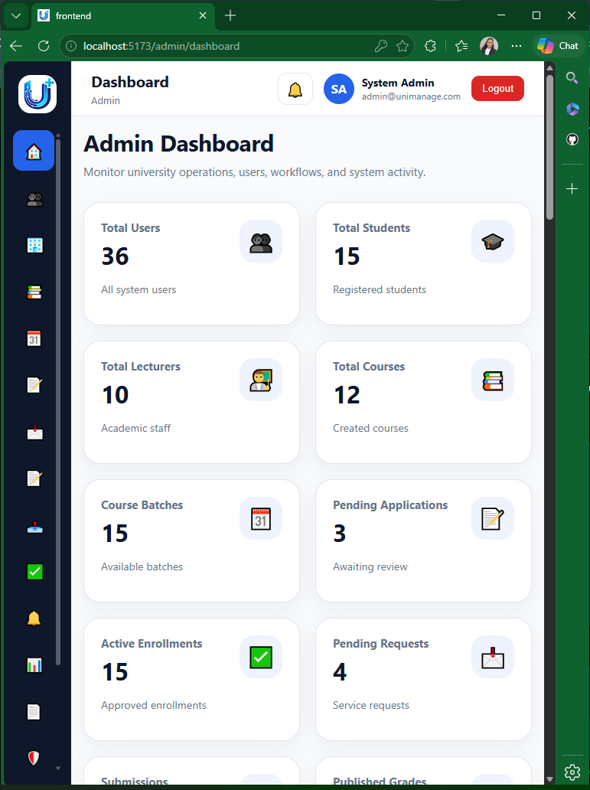

</td>

<td width="33%">

#### Mobile Dashboard
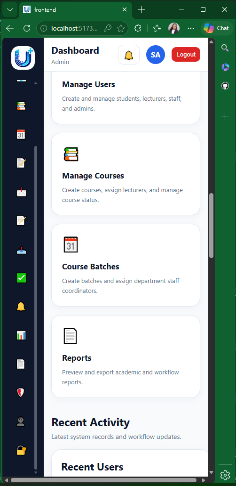

</td>

<td width="33%">

#### Mobile Profile
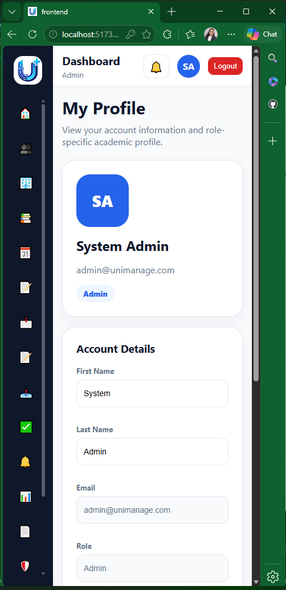

</td>

</tr>
</table>

---

## Testing & Validation

The platform was tested using:

- API testing,
- role-based authorization testing,
- workflow validation,
- responsive UI testing,
- file upload validation,
- authentication testing,
- and database integrity testing.

The testing process ensured proper workflow execution, secure access control, and stable academic operations across all user roles.

---

## Future Improvements

Potential future enhancements include:

- Email notifications
- Real-time websocket notifications
- AI-powered analytics
- Calendar integration
- Attendance management
- Online examinations
- Mobile application support
- Multi-university support
- Advanced workflow automation

---

## Academic Value

This project demonstrates practical implementation of:

- Full-stack web development
- RESTful API development
- Database design and normalization
- Authentication and authorization
- Enterprise workflow management
- Reporting and analytics systems
- Responsive UI/UX design
- Software engineering best practices
- Layered architecture implementation
- Secure academic system development

---

## Conclusion

UniManage Plus successfully demonstrates the design and implementation of a modern university service management platform capable of centralizing academic workflows, improving operational efficiency, enhancing workflow transparency, and supporting scalable university administration through secure enterprise-level architecture, workflow automation, analytics, reporting, and role-based access control.
